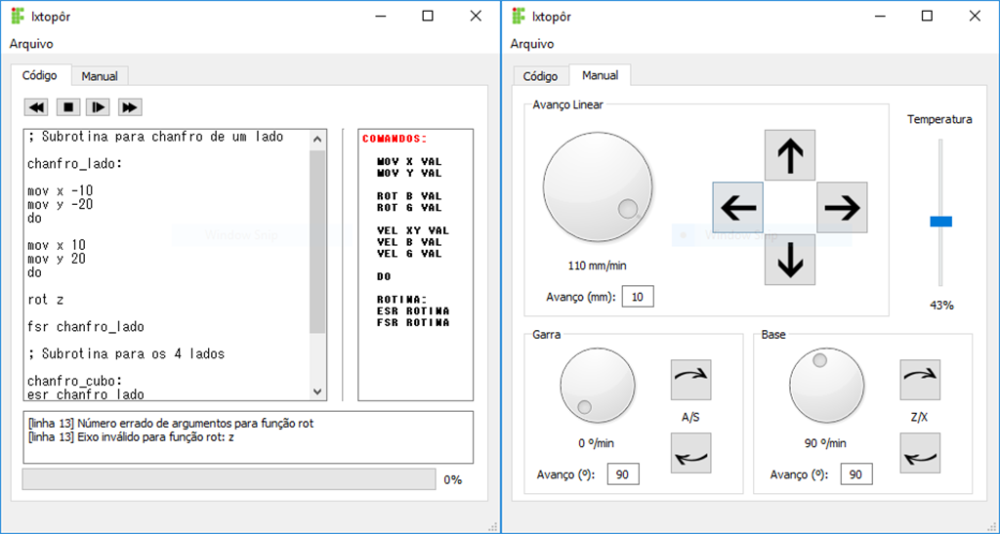
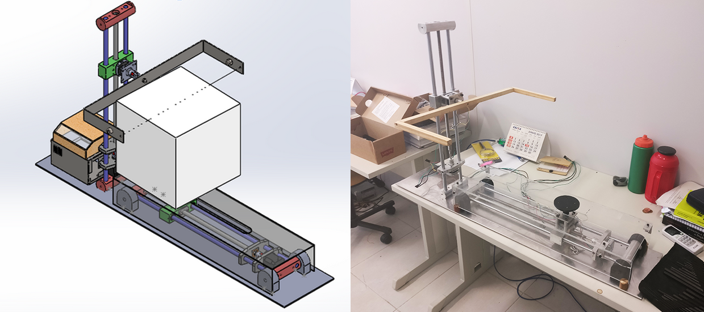
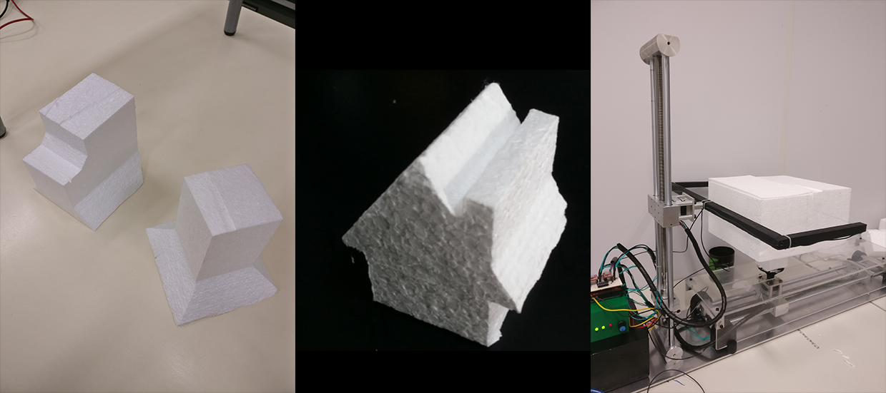

# Interface de Usuário _Ixtopor_

O Ixtopor é a máquina de corte de isopor programável projetada e construída por mim e meus colegas para o Projeto 
Integrador III (2017-2) do curso de Engenharia Mecatrônica no IFSC. 

O corte é feito através de um fio resistivo aquecido pela passagem de corrente. O bloco de isopor é fixo em uma base
móvel, e através da movimentação de 2 eixos lineares e 2 eixos rotativos formas complexas podem ser esculpidas no bloco.

Esse repositório contém o código da interface de usuário projetada com Qt, que permite tanto a programação da máquina 
quanto a movimentação manual em tempo real.

